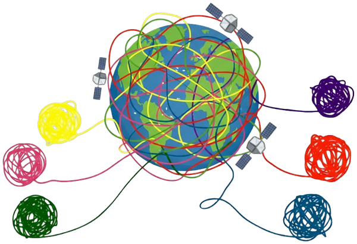
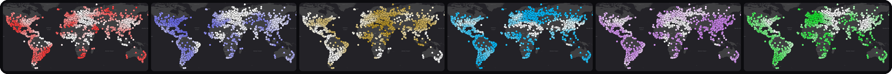
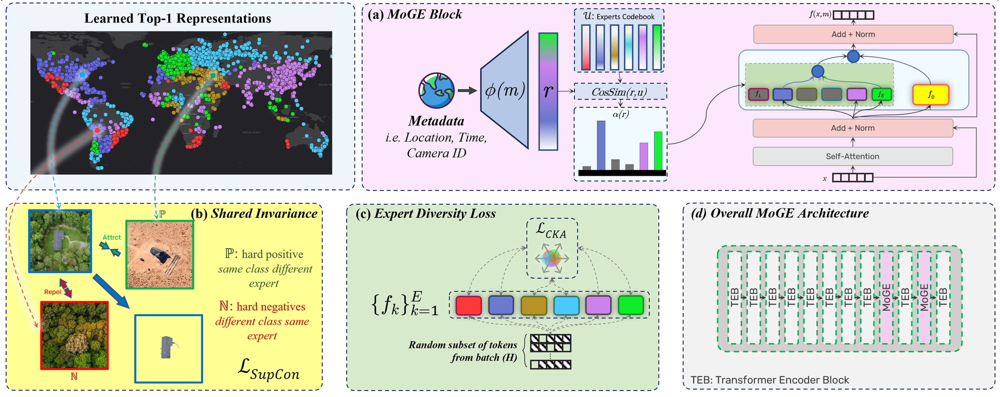
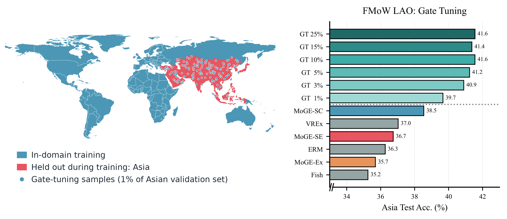

<p align="center">
  
</p>

<h1 align="center">Mixture of Geographical Experts:<br>Disentangling Earth</h1>

<p align="center">
  Moien Rangzan<sup>1,2</sup> · Gregory Duveiller<sup>2</sup> · Maha Shadaydeh<sup>1</sup> · Markus Reichstein<sup>2</sup> · Joachim Denzler<sup>1</sup>
  <br>
  <sup>1</sup>Computer Vision Group, Friedrich Schiller University Jena &nbsp;&nbsp; <sup>2</sup>Max Planck Institute for Biogeochemistry, Jena
</p>

<p align="center">
  
  <a href="assets/MoGE_GCPR2026_poster.pdf"></a>
  <a href="LICENSE"></a>
</p>

<p align="center">
  
  <br>
  <sub>Routing weights of MoGE's six experts on FMoW (stronger color means higher weight). The regions are learned from coordinates alone.</sub>
</p>

> [!NOTE]
> **Official implementation of MoGE (GCPR 2026).** The code will be available soon. Star or watch the repository to get notified.

## TL;DR

Most domain generalization methods assume that one predictor P(Y | X) holds everywhere. In Earth observation it often does not: a cluster of trees can be a natural forest in one region and a plantation in another. **MoGE** is a geo-routed Mixture-of-Experts that separates what is **invariant everywhere** from what **varies across space**.

- **Discovers its own domains.** A router driven by latitude and longitude, not by the image, activates a few geo-specialized experts. They self-organize into continuous, concept-consistent regions, so no hand-crafted domains are needed.
- **Two models in one.** An always-active shared expert learns features that hold everywhere. On its own (MoGE-SE), it is a domain-invariant model from the same training run.
- **Robust to location-class bias.** A probabilistic group-robust objective over router-induced soft groups keeps experts from relying on harmful regional priors.
- **Adapts cheaply.** Tuning only the gate (~5% of the weights) on 150 labeled samples adapts MoGE to an unseen continent.

## Method

<p align="center">
  
</p>

MoGE replaces the feed-forward network of selected ViT blocks with a geo-routed mixture of experts:

```math
f(x,m) = \underbrace{\gamma\, f_0(x)}_{\text{invariant}} + \underbrace{(1-\gamma)\sum_{k=1}^{E}\alpha_k\big(\phi(m)\big)\, f_k(x)}_{\text{specialized}}
```

**(a)** The location embedding φ(m) is matched against a learned expert codebook by cosine similarity, and the top-k experts are mixed. The shared expert f₀ is always active. **(b)** A supervised contrastive loss makes f₀ invariant across the discovered domains. **(c)** A CKA penalty keeps the specialists diverse. **(d)** Two MoGE blocks sit at layers 9 and 11 of a ViT-Tiny, with 6 experts and top-3 routing.

## Results

Both benchmarks use the same architecture and hyperparameters, with PG-DRO switched on for MapInWild. Values are mean ± std, with the best in bold. The table shows the strongest baselines.

<table>
  <thead>
    <tr>
      <th rowspan="2" align="left">Method</th>
      <th colspan="2" align="center">FMoW</th>
      <th colspan="3" align="center">MapInWild</th>
    </tr>
    <tr>
      <th align="center">WRA</th>
      <th align="center">Acc.</th>
      <th align="center">WGA</th>
      <th align="center">WCA</th>
      <th align="center">Acc.</th>
    </tr>
  </thead>
  <tbody>
    <tr>
      <td>ERM</td>
      <td align="center">32.43 <sub>±1.67</sub></td>
      <td align="center">53.69 <sub>±0.37</sub></td>
      <td align="center">52.18 <sub>±4.38</sub></td>
      <td align="center">70.40 <sub>±3.43</sub></td>
      <td align="center">77.16 <sub>±1.73</sub></td>
    </tr>
    <tr>
      <td>GroupDRO</td>
      <td align="center">30.70 <sub>±0.80</sub></td>
      <td align="center">49.06 <sub>±0.37</sub></td>
      <td align="center">57.25 <sub>±0.75</sub></td>
      <td align="center">73.87 <sub>±1.05</sub></td>
      <td align="center">75.70 <sub>±0.75</sub></td>
    </tr>
    <tr>
      <td>Fish</td>
      <td align="center">33.08 <sub>±0.29</sub></td>
      <td align="center">44.99 <sub>±0.72</sub></td>
      <td align="center">52.02 <sub>±1.85</sub></td>
      <td align="center">69.20 <sub>±1.14</sub></td>
      <td align="center">76.72 <sub>±1.39</sub></td>
    </tr>
    <tr>
      <td>ERM + LE</td>
      <td align="center">35.83 <sub>±0.51</sub></td>
      <td align="center">53.23 <sub>±0.72</sub></td>
      <td align="center">48.76 <sub>±9.12</sub></td>
      <td align="center">70.58 <sub>±3.43</sub></td>
      <td align="center">74.48 <sub>±1.46</sub></td>
    </tr>
    <tr>
      <td>D3G + LE</td>
      <td align="center">34.60 <sub>±1.27</sub></td>
      <td align="center">50.76 <sub>±0.12</sub></td>
      <td align="center">55.16 <sub>±6.33</sub></td>
      <td align="center">70.01 <sub>±5.31</sub></td>
      <td align="center"><b>77.82</b> <sub>±1.25</sub></td>
    </tr>
    <tr>
      <td>DCP + LE</td>
      <td align="center">35.97 <sub>±3.98</sub></td>
      <td align="center">52.30 <sub>±1.08</sub></td>
      <td align="center">51.39 <sub>±7.98</sub></td>
      <td align="center">64.43 <sub>±4.91</sub></td>
      <td align="center">75.42 <sub>±1.46</sub></td>
    </tr>
    <tr>
      <td><b>MoGE-SE</b> (ours)</td>
      <td align="center">33.01 <sub>±0.34</sub></td>
      <td align="center">48.60 <sub>±0.41</sub></td>
      <td align="center">57.83 <sub>±4.37</sub></td>
      <td align="center"><b>74.32</b> <sub>±1.07</sub></td>
      <td align="center">77.50 <sub>±0.96</sub></td>
    </tr>
    <tr>
      <td><b>MoGE</b> (ours)</td>
      <td align="center"><b>38.85</b> <sub>±2.50</sub></td>
      <td align="center"><b>55.25</b> <sub>±0.57</sub></td>
      <td align="center"><b>60.91</b> <sub>±1.38</sub></td>
      <td align="center">74.20 <sub>±1.51</sub></td>
      <td align="center">77.20 <sub>±0.53</sub></td>
    </tr>
  </tbody>
</table>

<sub>WRA, WGA, WCA: worst-region, worst-group and worst-class accuracy. LE: location encoder. MoGE-SE: the shared expert alone.</sub>

**Transfer to an unseen continent.** We train with Asia held out (FMoW-LAO), then tune only the gate on a few labeled Asian samples while the backbone and experts stay frozen. With 150 samples (1% of the validation set), MoGE already beats ERM and the domain-generalization baselines.

<p align="center">
  
</p>

<sub>GT x%: gate tuned on x% of the Asian validation set. MoGE-SC: MoGE with a frozen, pretrained SatCLIP encoder. MoGE-Ex: MoGE without any adaptation.</sub>

## Citation

```bibtex
@inproceedings{rangzan2026moge,
  title     = {Mixture of Geographical Experts: Disentangling Earth},
  author    = {Rangzan, Moien and Duveiller, Gregory and Shadaydeh, Maha and
               Reichstein, Markus and Denzler, Joachim},
  booktitle = {Pattern Recognition (Proceedings of DAGM GCPR 2026)},
  publisher = {Springer Nature},
  year      = {2026}
}
```

## Contact

Questions are welcome. Open an issue or email Moien Rangzan at mrangzan@bgc-jena.mpg.de.
